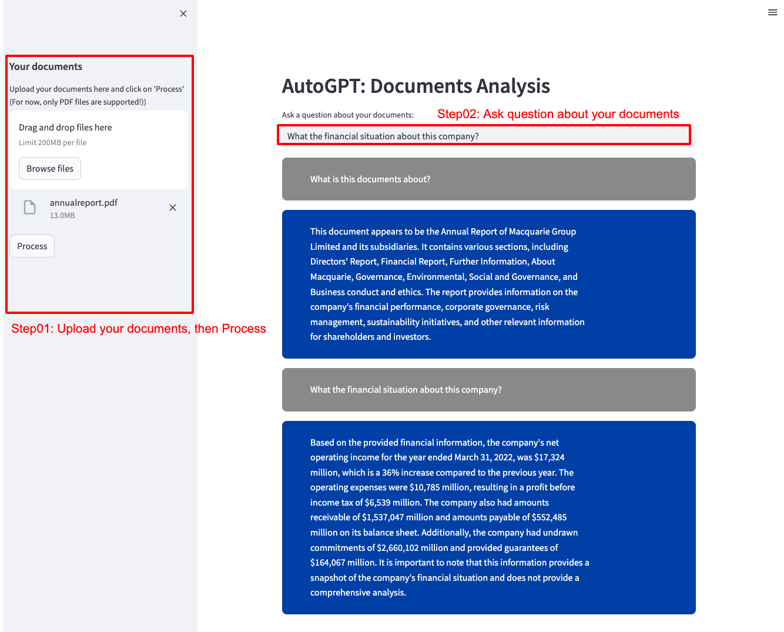

# Auto GPT: Documents Analysis

This is an Auto GPT APP for analyzing the document's content using natural language.
All you need to do is to upload documents that require analysis and ask questions, the app will get the answers for you.



## How to use

### Step 1: Install the requirements

```shell
pip install -r requirements.txt
```

### Step 2: Put your OpenAI API key in `apikey-template.py`, and rename it to `apikey.py`

### Step 3: Run the app script

```shell
streamlit run app.py
```

### Step 4: Ask questions about the documents' content.
